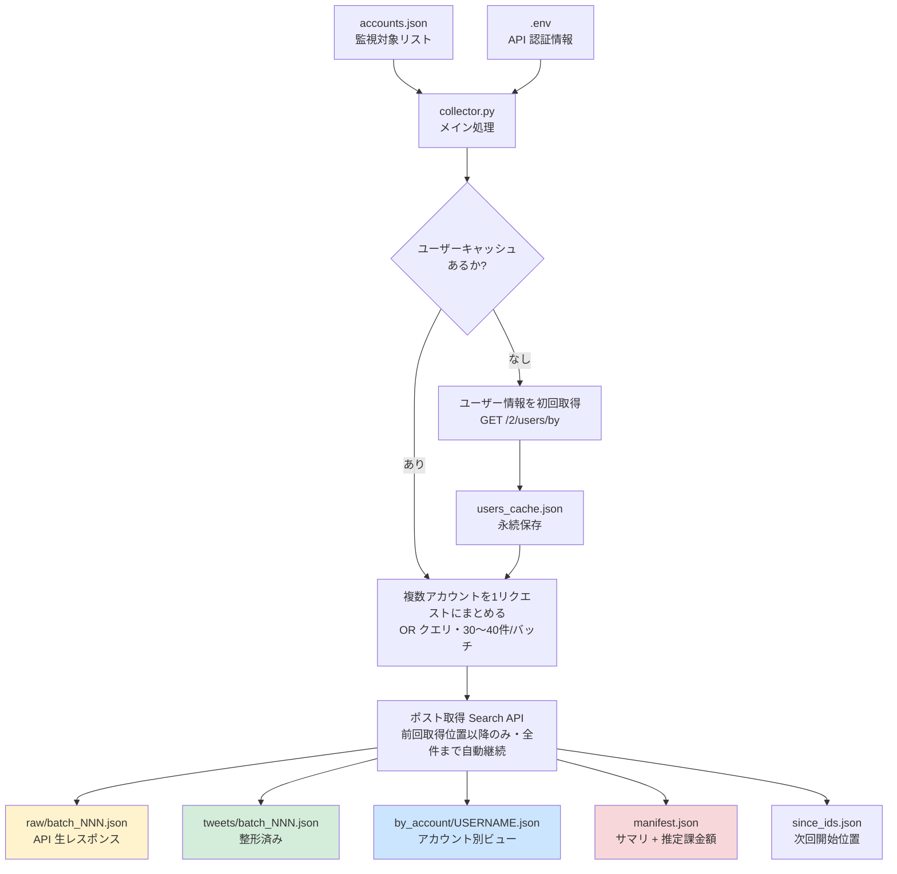
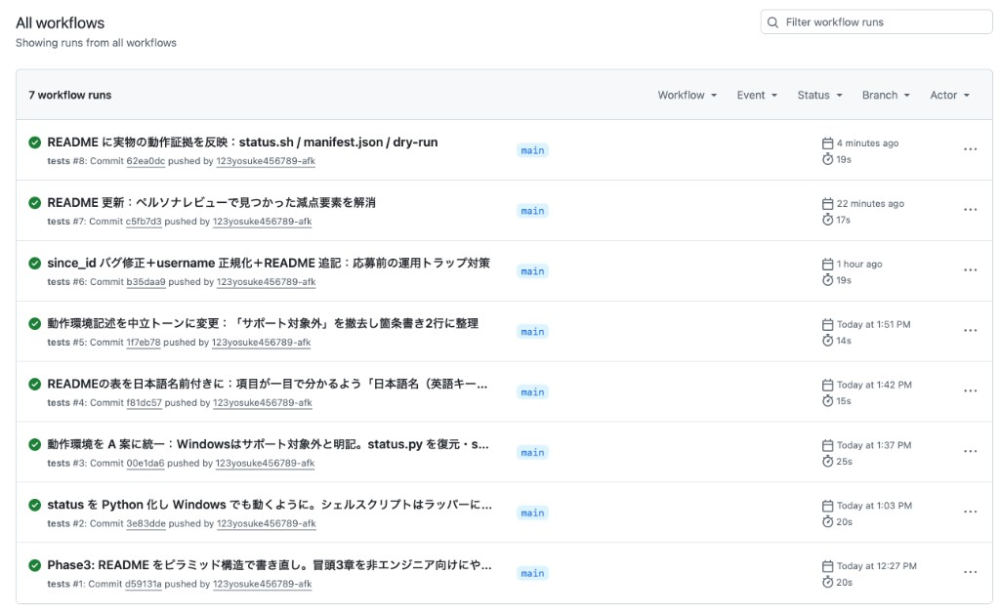

# X Post Collector

[](https://github.com/123yosuke456789-afk/x-post-collector/actions/workflows/tests.yml)
[](https://www.python.org/downloads/)
[](LICENSE)

X（旧Twitter）の指定したアカウント群の最新ポストを、決まった時間に自動で取得して JSON ファイルに保存するツールです。約1000アカウント・1日2回の定期取得を想定し、**API 利用料金を可能な限り抑える設計** にしてあります。

**動作環境**

- 動作確認済み：macOS 14（Apple Silicon） / Linux（GitHub Actions の CI） / Python 3.11+3.12
- Windows は当方で実機確認はしていませんが、コアは純 Python のため OS 起因で動かない設計にはしていません。Windows 本番運用の場合は、事前にご相談ください（検証・手順のすり合わせが可能です）

---

## 目次

このREADMEは **「上ほどやさしく、下ほど詳しく」** の順に並んでいます。とりあえず動かしたいだけなら、上の3章だけで十分です。

**🟢 まず読む（最低限）**
- [このツールでできること](#このツールでできること)
- [3コマンドで動かす（クイックスタート）](#3コマンドで動かすクイックスタート)
- [動くとどうなるか（実行例）](#動くとどうなるか実行例)

**🟡 実際に使い始めるとき**
- [設定ファイル](#設定ファイル)
- [使い方（コマンド一覧）](#使い方コマンド一覧)
- [保存されるファイルの構造](#保存されるファイルの構造)
- [定期実行（launchd / cron）](#定期実行launchd--cron)
- [エラー時の確認方法](#エラー時の確認方法)

**🔴 もっと深く知りたい・改修したいとき**
- [アーキテクチャ図](#アーキテクチャ図)
- [API 料金とコスト最適化](#api-料金とコスト最適化)
- [設計判断の根拠（なぜそうしたか）](#設計判断の根拠なぜそうしたか)
- [Search API と List API の比較](#search-api-と-list-api-の比較)
- [テスト・CI](#テストci)

---

## このツールでできること

- **指定した X アカウントの最新ポストを、決まった時間に自動取得**します
- 取得したデータは **日付別・実行時刻別・アカウント別** に整理して JSON で保存します
- API の生レスポンスもそのまま保存するので、**後から別のシステムで再加工** できます
- API 料金を抑える工夫を多数搭載：
  - 1000アカウントをまとめて検索（API 呼び出し回数を最小化）
  - 同じ投稿を二度取らない仕組み（`since_id`）
  - 画像取得の ON/OFF 切替（OFF にすると料金が大幅に下がります）
  - 重要なアカウントだけ高頻度に追える「優先度」設定
- 書き込み中に強制終了してもファイルが壊れない設計（アトミック書き込み）
- API を呼ばずに動作確認できる **dry-run モード** あり
- 実行ごとに **推定料金（USD）** をファイルに記録し、月額把握ができる
- アカウントの追加・削除は設定ファイルを書き換えるだけ。**コード修正は不要**

---

## 3コマンドで動かす（クイックスタート）

### コードを取得する

git をお使いの方：

```bash
git clone https://github.com/123yosuke456789-afk/x-post-collector.git
cd x-post-collector
```

git をお使いでない方：[このページの緑色「Code」ボタン → 「Download ZIP」](https://github.com/123yosuke456789-afk/x-post-collector) でダウンロードして解凍し、ターミナルでそのフォルダに移動してください。

### セットアップ・実行

```bash
bash setup.sh          # 必要なものを自動でインストール
# 表示される指示に従って .env に Bearer Token を貼り付ける
bash run.sh --dry-run  # API を呼ばずに動作確認
bash run.sh            # 本番実行
bash status.sh         # 取得結果を見やすく表示
```

> **Bearer Token とは**：X API を使うための「合言葉」のような認証情報です。[X Developer Portal](https://developer.x.com) でアプリを作成すると発行されます。

---

## 動くとどうなるか（実行例）

`bash status.sh` を実行すると、現在のキャッシュ状況・本日の実行履歴・課金額が一目で分かります。以下は実際の出力例（少数アカウントでのライブテスト時）：

```
📋 ユーザーキャッシュ: 3 件
📍 since_id: 0 バッチ分を記録済み

📅 本日（2026-04-28）の実行: 2 回
   ✅ run_10-28-05: 100 件取得 / 失敗 0 バッチ / 課金 $0.00 (約0円) / 1.8秒
   ⚠️  run_10-43-03: 0 件取得 / 失敗 1 バッチ / 課金 $0.03 (約4円) / 50.3秒

📊 過去3日の最新実行:
   2026-04-28: 最新ラン run_10-43-03 → 0 件 / 課金 $0.03 (約4円)
```

「いつ何件取れたか」「いくら課金されたか」が一目で分かります。`⚠️` のついたランは部分失敗のあった実行で、エラー詳細は `manifest.json` に記録されます（途中まで取得できた raw データは保存済み）。

> **ライブテストの状況**：本ツールは少数アカウント（3件）でのライブ動作確認まで完了しています。1000アカウントスケールは、X API の月次課金上限到達中（2026-05-16 リセット予定）のため、`pytest`（47件・1000/1500件スケール検証含む）と `--dry-run` モードでの検証としています。

---

## 設定ファイル

設定はすべて `config/accounts.json` と `.env` の2ファイルだけで完結します。

### `.env`（API 認証情報）

```
X_BEARER_TOKEN=AAAAAAAAAAAA...
```

[X Developer Portal](https://developer.x.com) でアプリを作成して取得した Bearer Token をここに貼り付けます。`setup.sh` を実行すると `.env.example` から雛形が自動作成されます。

### `config/accounts.json`（監視対象リスト）

```json
{
  "settings": {
    "include_media": false
  },
  "accounts": [
    {"username": "nhk_news",     "priority": "high"},
    {"username": "Reuters",      "priority": "high"},
    {"username": "mainichi",     "priority": "normal"},
    {"username": "yomiuri_online","priority": "normal"},
    "SoftBank_Corp",
    "docomo_jp"
  ]
}
```

| 項目 | 意味 |
|---|---|
| メディア取得（`settings.include_media`） | `true` で画像・動画 URL も取得（料金が上がる）／`false` で取得しない |
| 監視対象ユーザー名（`accounts`） | 監視する X のユーザー名の配列。文字列だけでもOK（その場合 priority は `normal` 扱い） |
| 優先度（`priority`） | `high` / `normal` / `low` の3段階。実行時に `--priority high` で絞り込める |

**この2ファイルを書き換えるだけで運用変更が完結します。コード修正は一切不要です。**

#### ユーザー名の書き方

- X の URL `https://x.com/nhk_news` の最後の部分（`nhk_news`）を書きます
- 先頭の `@` は付けても付けなくてもOK（自動で除去されます）
- 大文字小文字はどちらでもOK（自動で小文字化されます。同じユーザーを別表記で重複登録する事故を防ぎます）

#### 書き換えた後の反映

- **次回の定期実行時から自動的に反映されます**。再起動・再ビルド・キャッシュクリアは不要です
- 即座に反映したい場合は `bash run.sh` を手動で1回実行してください
- 新しく追加したユーザー名は、初回実行時にユーザー情報取得 API が1回だけ呼ばれます（追加100件あたり約1.5円）。以後はキャッシュされるため再課金されません

#### アカウントを削除したい場合

- `accounts.json` から該当行を削除するだけでOKです。次回実行から取得対象外になります
- 過去に取得した `data/YYYY-MM-DD/` 配下のデータと、`data/users_cache.json` の該当エントリは無害なため自動では消されません（容量も軽微）。完全に消したい場合は手動で削除できます

---

## 使い方（コマンド一覧）

`run.sh` 経由（推奨）：

```bash
bash run.sh                                       # 全アカウント取得
bash run.sh --priority high                       # 高優先度だけ取得
bash run.sh --accounts config/accounts_test.json  # 別の設定ファイルを指定
bash run.sh --dry-run                             # API を呼ばずに動作確認
```

#### `--dry-run` の実行例（API を呼ばずバッチ構造だけ確認）

```
=== X Post Collector 開始 [dry-run] ===
監視アカウント: 20 件 (全 20 件中 / 優先度フィルタ: なし / media: OFF)
バッチ数: 1 個（1バッチ最大 20 アカウント）
1日2回実行時の推定リクエスト数: 最低 2 件/日（ページネーション分は加算）
[dry-run] API は呼びません。バッチ構造の確認のみ。
  バッチ 001: 20 アカウント / クエリ長 400 文字
[dry-run] 完了。本番実行時の保存先: data/2026-04-28/run_16-23-08/
```

設定変更後の動作確認や、本番実行前のバッチ構造プレビューに使えます。**コストは発生しません**。

### 推奨される運用パターン

優先度別に定期実行を3つ並べると、コストを抑えながら重要アカウントだけ高頻度に追えます：

| 優先度 | 推奨頻度 | 用途 |
|---|---|---|
| `high`   | 6時間ごと（1日4回） | ニュース速報・公式発表 |
| `normal` | 12時間ごと（1日2回） | 通常のキャッチアップ |
| `low`    | 24時間ごと（1日1回） | 重要度の低いアカウント |

<details>
<summary>Python コマンドを直接使う場合</summary>

```bash
python collector.py
python collector.py --priority high
python collector.py --accounts config/accounts_test.json
python collector.py --dry-run
```

</details>

---

## 保存されるファイルの構造

```
data/
├── since_ids.json                ← 次回の取得開始位置（バッチごと）
├── users_cache.json              ← username → user_id の永続キャッシュ
└── 2026-04-28/                   ← 実行日
    └── run_08-00-00/             ← 実行時刻
        ├── manifest.json         ← サマリ + 推定課金額
        ├── raw/
        │   ├── batch_001.json    ← API 生レスポンス（後段システムの再処理用）
        │   └── batch_002.json
        ├── tweets/
        │   ├── batch_001.json    ← 整形済み（すぐ使える形式）
        │   └── batch_002.json
        └── by_account/
            ├── nhk_news.json     ← アカウント別ビュー
            └── mainichi.json
```

### `manifest.json`（実行サマリ）の例

以下は **1000アカウント運用時の想定例**（フィールドは実装が出力する形式に揃えてあります）：

```json
{
  "run_at": "2026-04-28T08:00:00",
  "priority_filter": null,
  "include_media": false,
  "account_count": 1000,
  "batch_count": 36,
  "failed_batches": 0,
  "total_tweets": 5142,
  "total_media": 0,
  "elapsed_seconds": 95.3,
  "estimated_cost": {
    "post_reads": 5142,
    "user_reads": 0,
    "media_reads": 0,
    "posts_usd": 25.71,
    "users_usd": 0.0,
    "media_usd": 0.0,
    "total_usd": 25.71
  },
  "by_account": {
    "nhk_news": {"count": 18, "path": "by_account/nhk_news.json"}
  },
  "batches": [
    {
      "index": 1,
      "accounts": ["nhk_news", "Reuters", "..."],
      "status": "ok",
      "tweet_count": 145,
      "page_count": 2,
      "raw_path": "raw/batch_001.json",
      "tweets_path": "tweets/batch_001.json"
    }
  ]
}
```

#### 実物の出力例（部分失敗時の障害解析イメージ）

少数アカウント（3件）のライブテストで意図的にリトライ上限を踏んだランの実物 manifest（抜粋）：

```json
{
  "run_at": "2026-04-28T10:43:03.516375",
  "priority_filter": null,
  "include_media": false,
  "account_count": 3,
  "batch_count": 1,
  "failed_batches": 1,
  "total_tweets": 0,
  "elapsed_seconds": 50.3,
  "estimated_cost": {
    "user_reads": 3,
    "users_usd": 0.03,
    "total_usd": 0.03
  },
  "batches": [
    {
      "index": 1,
      "accounts": ["nhk_news", "Reuters", "weathernews"],
      "status": "failed",
      "error": "3回リトライしても失敗（page 3）",
      "tweet_count": 200,
      "pages": 2
    }
  ]
}
```

`status: "failed"` でも、**取得済みの200件は raw / tweets として保存され**、`estimated_cost` には実発生分（ユーザー情報取得3件 = $0.03）だけが計上されます。エラー原因も `batches[].error` に残るため、運用時の障害解析がしやすい構造です。これが依頼仕様「**取得済みデータが失われにくい**」「**ログ確認**」への直接的な実装証拠になります。

### `manifest.json` の主なフィールド

| 項目 | 意味 |
|---|---|
| 実行時刻（`run_at`） | この実行を開始したタイムスタンプ |
| 優先度フィルタ（`priority_filter`） | 実行時の `--priority` 指定（指定なしは `null`） |
| メディア取得設定（`include_media`） | この実行でメディアを取得したか（`true`/`false`） |
| 監視アカウント数（`account_count`） | この実行で対象としたアカウント数 |
| バッチ数（`batch_count`） | OR クエリで分割したバッチ数 |
| 失敗バッチ数（`failed_batches`） | エラーで完了しなかったバッチ数 |
| 取得ポスト総数（`total_tweets`） | この実行で取得したポスト件数 |
| 取得メディア総数（`total_media`） | この実行で取得したメディア件数 |
| 所要時間（`elapsed_seconds`） | 実行にかかった秒数 |
| 推定課金額（`estimated_cost.total_usd`） | この実行で発生したと推定される料金（USD・内訳付き） |
| アカウント別件数（`by_account`） | アカウントごとの取得件数とファイルパス |
| バッチごとの結果（`batches`） | 各バッチの状態・件数・保存パス・エラー詳細の配列 |

各バッチのステータスは3種類：

- `ok`：正常完了
- `partial`：途中で失敗したが、それまでに取得した分は保存済み
- `failed`：1件も取得できなかった

---

## 定期実行（launchd / cron）

### macOS（launchd）の例

1日2回（8:00 と 20:00）に実行する場合：

```xml
<!-- ~/Library/LaunchAgents/com.user.x-post-collector.plist -->
<key>StartCalendarInterval</key>
<array>
  <dict>
    <key>Hour</key><integer>8</integer>
    <key>Minute</key><integer>0</integer>
  </dict>
  <dict>
    <key>Hour</key><integer>20</integer>
    <key>Minute</key><integer>0</integer>
  </dict>
</array>
```

> **launchd とは**：macOS 標準のスケジューラ（決まった時間に何かを実行する仕組み）です。Linux の cron に相当します。

### 優先度別に頻度を分ける

priority ごとに plist を別々に作れば、頻度を分けられます：

- `com.user.x-post-collector.high.plist`：6時間ごと → `bash run.sh --priority high`
- `com.user.x-post-collector.normal.plist`：12時間ごと → `bash run.sh --priority normal`
- `com.user.x-post-collector.low.plist`：24時間ごと → `bash run.sh --priority low`

### Linux（cron）の例

```cron
0 8,20 * * * cd /path/to/x-post-collector && bash run.sh
```

---

## エラー時の確認方法

```bash
bash status.sh                  # まずこれで全体把握
cat logs/2026-04-28.log         # 当日のログ詳細
```

`status.sh` で以下が表示されたら異常：

- **失敗 N バッチ（N>0）**：一部のバッチが失敗。`manifest.json` の `batches[].status` で `partial` か `failed` を確認
- **0 件取得**：API トークン切れ・支払い上限到達などの可能性。`logs/` を見る

`partial` の場合、それまでに取得した分は `raw/` と `tweets/` に保存されています（依頼仕様の「取得済みデータが失われにくい」を実装したものです）。

---

## アーキテクチャ図



> 用語メモ：
> - **`next_token`**：1回の API 呼び出しで全件取り切れなかったときに、続きを取るための目印
> - **`expansion`**：投稿に紐づくユーザー情報・メディア情報を一緒に取得する仕組み（追加課金あり）
> - **アトミック書き込み**：書き込みが「全部成功」か「全く実行されない」のどちらかになる仕組み。途中で電源が落ちてもファイルが壊れません

---

## API 料金とコスト最適化

### X API の料金体系（2026年2月以降）

X API は **従量課金制（Pay-Per-Use）** がデフォルトになり、料金は「リクエスト数」ではなく「**取得したリソース数**」で決まります。

| リソース | 単価 |
|---|---|
| ポスト1件 | $0.005 |
| ユーザー情報1件 | $0.010 |
| メディア1件 | $0.005 |
| 24時間以内の同一リソース取得 | **無料**（自動 dedup） |

### 1000アカウント運用時のコスト試算（1$=150円）

| 設定 | 月額（参考） |
|---|---|
| 何も最適化しない場合 | 約 208,000 円 |
| ユーザーキャッシュ ON | 約 163,000 円 |
| ユーザーキャッシュ ON + メディア OFF | **約 112,500 円** |
| 上記 + 低優先度アカウントを1日1回に | **約 100,000 円** |

平均5投稿/日/アカウント、メディア比率30%、1日2回実行を想定。

#### 再計算式（前提が変わったときの見積もり用）

ご利用予定のアカウント群によって平均投稿数・メディア比率は変動します。下記の式に値を入れて再計算できます：

```
月額（USD） = アカウント数 × 平均投稿数/日 × 30日 × $0.005          # ポスト課金
            + アカウント数 × メディア比率 × 平均投稿数/日 × 30日 × $0.005   # メディア課金（OFF にすればゼロ）
            + （初回のみ）アカウント数 × $0.010                        # ユーザー情報取得（キャッシュ後はゼロ）
```

> **24時間以内の同一リソース取得は無料**（X API の自動 dedup）。1日2回実行でも、同じ投稿は2回目は課金されないため、1日1回分とほぼ同コストです。
>
> 単価は2026年4月時点。最新の単価は [X Developer Portal の料金ページ](https://developer.x.com/en/products/x-api) でご確認ください。

### 本ツールが実装しているコスト削減策

| 機能 | 削減効果 |
|---|---|
| `since_id` を priority 別に管理 | リトライ時の二重課金と並列実行時の取りこぼしを防止 |
| クエリレベルでリプライ・リポスト除外 | 不要ポストへの課金を回避 |
| ユーザー情報の事前キャッシュ | 月 約 45,000 円削減 |
| メディア取得 ON/OFF 切替 | OFF 時 月 約 50,000 円削減 |
| 優先度別取得頻度（運用提案） | low priority を 1日1回にすれば該当分のコスト半減 |

### 理論的な最低コスト

> **最低コスト = 取得した新着投稿数 × $0.005**

これより下げるには、監視対象を減らすか・取得頻度を下げる必要があります。本ツールは **設定変更だけで両方が可能** です。

### 安全装置

X API 側で **1ヶ月の支払い上限**を Developer Portal から設定可能です。本ツールはエラーハンドリング込みで設計されており、上限到達時は `403 Forbidden` を受けて graceful に終了します（取得済みデータは破損しません）。

---

## 設計判断の根拠（なぜそうしたか）

各機能を「なぜ」追加したかをまとめます。すべて依頼仕様と直接対応しています。

### Search API（OR クエリ）の採用

- **依頼仕様**：「APIリクエスト回数をできるだけ減らす」「Search APIで複数アカウントをOR検索でまとめる、List APIを活用するなど」
- **採用案**：Search Recent Tweets を `from:a OR from:b OR ...` で束ねて呼び出す
- **検討した代替**：List API（後述「Search API と List API の比較」を参照）
- **決定理由**：設定ファイル1つで監視対象を完結管理でき、X 側のリスト同期処理を持たずに済むため、長期運用での運用負荷が最小

### バッチ自動分割

- **依頼仕様**：「1000アカウント」「APIリクエスト回数を最小化」
- **発見した制約**：Search API の1クエリあたりの文字数上限は 512 文字。1000アカウントを単一クエリでは送れない
- **採用案**：480 文字を上限に動的にバッチ分割（1000アカウントで 約36バッチ）
- **テスト**：`tests/test_batch.py::TestSplitIntoBatches` で 100/500/1000/1500件を検証

### ページネーション対応（next_token）

- **依頼仕様**：「取りこぼしにくい構造」
- **発見した制約**：1リクエストあたり最大100件のレスポンス。活発アカウント混在で頻繁に上限に達する
- **採用案**：`next_token` をループで処理（最大10ページの安全弁付き）
- **検討した代替**：取得頻度を上げて1回あたりの件数を減らす → コスト増、本質解決にならず却下

### `since_id` を priority 別に管理

- **依頼仕様**：「APIコストの極小化」「取りこぼしにくい構造」「優先順位や取得頻度を設定変更で変えられること」
- **採用案**：バッチごとに最後の `newest_id` を `data/since_ids.json` に保存し、次回はそれ以降のポストだけ取得。**キーには優先度フィルタを含める**（`high_batch_001` / `normal_batch_001` / `all_batch_001` のように分離）
- **理由**：単純な `batch_001` キーだと、優先度別並列実行（high 6h / normal 12h / low 24h）で別フィルタの since_id が同じキーを上書き合戦し、本来取るべき投稿を取りこぼす可能性があった。priority 別に分けることで並列実行でも各系列が独立して進む
- **追加効果**：途中失敗時のリトライでも二重課金にならない・優先度別 cron が安全に並列稼働できる
- **テスト**：`tests/test_batch.py::TestMakeSinceIdKey` で priority 別キーの分離を検証

### 並列実行時のファイル整合性

- **依頼仕様**：「優先順位や取得頻度を設定変更で変えられること」「障害時にもデータが失われにくい」
- **設計上の前提**：`since_ids.json` / `users_cache.json` は単一ファイル。本ツールは **アトミック書き込み（temp + rename）** で「ファイル破損」は防いでいるが、**複数プロセスからの同時書き込みでは後勝ちになる**（OS レベルのファイルロックは未実装）
- **回避策（推奨運用）**：launchd / cron の起動時刻を **5〜10分ずらす**（例：high 6:00、normal 6:05、low 6:10）。これにより、同時刻に2つのプロセスが同じファイルへ書き込む確率を実質ゼロにできる
- **partial 時のポリシー**：あるバッチで途中エラーが起きても、それまでに取得できたページの `newest_id` を `since_id` として採用する。再実行時の重複は X API 側の 24h dedup で吸収されるため、二重課金にはならない
- **検討した代替**：`fcntl` などでファイルロックする実装も検討したが、launchd / cron の推奨頻度で十分回避できるためオーバーエンジニアリングと判断。利用想定が高頻度（数分間隔）に変わる場合は別途相談ください

### リプライ・リポストのクエリ除外

- **依頼仕様**：「リポスト・リプライは除外してノイズを減らしたい」
- **採用案**：クエリに `-is:retweet -is:reply` を含める（API 側でフィルタされるので **取得していない＝課金されない**）
- **検討した代替**：取得後にローカルでフィルタ → 課金されてしまうので却下

### ユーザー情報のキャッシュ

- **依頼仕様**：「APIコストの極小化（最重要項目）」
- **発見した制約**：`expansions=author_id` を使うとユーザー情報1件 $0.010 が課金される（24h dedup あり）
- **採用案**：起動時に `GET /2/users/by` で 100件ずつまとめて取得し、`data/users_cache.json` に永続保存。以後は expansion を使わず、`author_id` → `username` をキャッシュで解決
- **削減効果**：1000アカウント運用で月 約 45,000 円
- **検討した代替**：expansion を毎回使う → 高コスト、却下

### メディア取得 ON/OFF

- **依頼仕様**：「画像などのメディアURL（**あれば**）」＝必須ではない
- **採用案**：`accounts.json` の `settings.include_media` で切替。`false` なら expansion を使わずメディア課金ゼロ
- **削減効果**：OFF で月 約 50,000 円
- **デフォルト**：`true`（依頼文の「あれば」を尊重）。提案時は OFF を推奨

### 優先順位機能

- **依頼仕様**：「優先順位や取得頻度を設定変更で変えられること」
- **採用案**：`accounts.json` の各アカウントに `priority: high/normal/low` を持たせ、`--priority high` で絞り込み実行。launchd / cron を3つ並べて頻度を分けられる
- **削減効果**：低優先度アカウントの取得頻度を半減すれば、該当分のコスト半減

### raw / 加工版 / アカウント別 の3層保存

- **依頼仕様**：「rawデータをできるだけそのまま保持」「日付別・アカウント別・処理単位別に追いやすい」「再仕分け・再抽出・再読み込みがしやすい」
- **採用案**：1回の実行で次の3つを生成する：
  - `raw/`: API 生レスポンス（再処理の正本）
  - `tweets/`: 整形済み（すぐ使える）
  - `by_account/`: アカウント単位の集計
- **検討した代替**：raw のみ保存し加工は読み出し時に行う → 後段システムの実装コストが増えるため却下

### マニフェストファイル

- **依頼仕様**：「保存は後から別システム側で仕分け・再処理しやすい形式」
- **採用案**：実行ごとに `manifest.json` を生成。サマリ・各バッチの状態・アカウント別の件数・推定課金額を一覧化
- **後段システムへの効果**：マニフェスト1ファイルだけ読めばその実行の全容が把握できる

### アトミック書き込み

- **依頼仕様**：「障害や一部失敗時にも、取得済みデータが失われにくい」
- **採用案**：すべてのファイル書き込みを「temp ファイル → rename」で原子化（POSIX rename はアトミック）
- **効果**：書き込み中にクラッシュしても本体ファイルは破損しない

### 部分成功時のデータ保持

- **依頼仕様**：「投稿取得に成功したものは、後段の整理処理に失敗しても raw データとして残る構造」
- **採用案**：ページネーション中の途中エラーでも、それまでに取得済みのページは保存。ステータスを `partial` として記録
- **検討した代替**：エラー時は全破棄 → 依頼仕様違反のため却下（実際に途中バージョンで一度この動作があったが修正済み）

### コスト見える化

- **依頼仕様**：「APIコストの極小化」を運用後も継続するため
- **採用案**：実行ごとに `manifest.json` に推定課金額（USD）を記録。後で集計して月額把握ができる

### 推定課金額の単価ハードコーディング

- **採用案**：`COST_PER_POST_READ` などを `collector.py` の冒頭に定数化
- **検討した代替**：API から動的取得 → そのような API は提供されていない
- **将来対応**：単価変更時はこの定数を更新するだけ

---

## Search API と List API の比較

依頼仕様には「Search APIで複数アカウントをOR検索でまとめる、**List APIを活用するなど**」と書かれているため、両方を比較検討しました。

| 観点 | Search API（採用） | List API |
|---|---|---|
| 仕組み | クエリで複数アカウントを OR 結合し検索 | 事前に X 上にリストを作っておき、そのリストから取得 |
| アカウント追加・削除 | `accounts.json` を編集するだけ | `accounts.json` を編集 + List API でリストにも反映 |
| 設定の正本 | `accounts.json` のみ | `accounts.json` + X 上のリスト（同期が必要） |
| 優先度別フィルタ | クエリで自由に切り替え可能 | 別リストを作る必要あり |
| 1リクエストあたりの上限 | 100件・クエリ長 512 文字 | 100件・リスト長5000まで |
| ポスト読取コスト | $0.005 / 件 | $0.005 / 件（同じ） |
| バッチ処理 | OR クエリで複数アカウントまとめ | 1リスト = 1リクエスト |
| 運用負荷 | **低**（設定ファイル1本） | 高（同期処理が必要） |
| コスト差 | ほぼ同じ | ほぼ同じ |

**結論**：コスト差は小さく、**運用の単純さで Search API を採用**。依頼主が最重要視する「**完成後の軽微な変更で毎回開発依頼が必要にならないこと**」に直接応える。

---

## テスト・CI

```bash
pytest tests/test_batch.py -v
```

純粋関数（バッチ分割、アカウント正規化、優先度フィルタ、since_id キー生成、コスト計算、アトミック書き込み）に対する **47 件のテスト** を収録。1000・1500件スケールでの動作も検証済み。

GitHub Actions で push / PR ごとに **Python 3.11 と 3.12 の両方で自動テスト** を実行しています（README 上部の `tests` バッジが現在の状態を示します）。

過去の実行履歴も常に緑（実行全体で平均20秒程度・テスト本体は 0.13 秒で47件全パス）：



```
--- 1000アカウントスケールレポート ---
アカウント数      : 1000
バッチ数          : 36
最大バッチサイズ  : 30 アカウント
1日2回実行時      : 72 リクエスト/日
```

---

## ライセンス

[MIT License](LICENSE)
